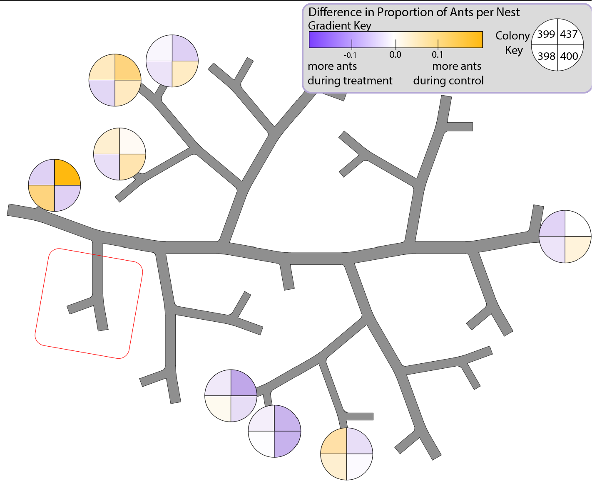

Load Packages
```{r}
library(tidyverse)
library(broom)
library(ggplot2)
library(ggimage)
library(ggpp)
library(glmmTMB)
library(sjPlot)
theme_set(theme_classic())
```
# Data Sets
Load the CSV

```{r}
ants_wide <- read_csv("Competition experiment data - Tidy Census.csv")
```

Let's add a column of the queens as a binary true/false
```{r}
ants_wide <- ants_wide %>% mutate(queentf = ifelse(queen>0,TRUE, FALSE), broodtf = ifelse(brood == "y", TRUE, FALSE))
```

A long data set may work best for some visualizations (bar plot) and tests
```{r}
# create a data set by making data long
ants_long <- ants_wide %>% 
  pivot_longer(c(`workers`, `soldiers`, `queen`, `winged queens`, `males`), names_to = "caste", values_to = "count")
```

## mutations and variations on ants_wide
For representing the number of ants in a nest as a proportion of the colony, we want to save the total population (may be relevant) and the population **in nests**.

### Sum of workers
Add a column for the sum of workers, which is both workers and soldiers

```{r}
ants_wide <- ants_wide %>% 
  filter(type != "test", nest != "dead", nest != "outside", nest != "base") %>%
  mutate(
    workerSum = workers + soldiers)
colnames(ants_wide)[1] ="colony"

```


### Total population data
First add in colony population numbers (not useful for proportion, but good to have)

```{r}
population <- read_csv("Competition experiment data - Population at Start Summary.csv")
```
merge this with ants_wide. Currently throwing an error. As of right now, this data is not being used, so it will be commented out.

```{r}
#ants_wide <- ants_wide %>% 
 # mutate(left_join(ants_wide, population))

```
### Populations in nests data
Add in colony population that was **in nests**. Then, get the proportion of ants for that nest.

```{r}
#nest pop for each colony

nest_population <- ants_wide %>% 
  filter(type != "test", nest != "dead", nest != "outside", nest != "base") %>%
  group_by(`colony`, type) %>% 
  summarize(tot_nest_pop = sum(workers + soldiers))

ants_wide <- ants_wide %>% 
  mutate(left_join(ants_wide, nest_population))


ants_wide <- ants_wide %>% 
  mutate(ants_nest_prop = (workers+soldiers)/tot_nest_pop)

```
An even wider data set may work best for obtaining the difference in proportion, such that the control and treatment proportions are in one colony+nest observation.
```{r}
# create a data set of colony, nest, control proportion, and treatment proportion
treatment_proportion_data <- ants_wide %>% 
  filter(type != "test", nest != "dead", nest != "outside", nest != "base", type == "treatment") %>% 
  select(`colony`, `nest`, `ants_nest_prop`)

colnames(treatment_proportion_data) <- c('colony', 'nest' , 'treatment_prop')


control_proportion_data <- ants_wide %>% 
  filter(type != "test", nest != "dead", nest != "outside", nest != "base", type == "control") %>% 
  select(`colony`, `nest`, `ants_nest_prop`)

colnames(control_proportion_data) <- c('colony', 'nest' , 'control_prop')

proportions <- treatment_proportion_data %>% 
  mutate(left_join(treatment_proportion_data, control_proportion_data))

#NEW DATA SET IS CALLED "PROPORTIONS"
proportions <- proportions %>% 
  mutate(diff_in_prop = control_prop - treatment_prop)

```
### Region assignment
Add in a column for region assignment (used in GLMM)
Add a column that assigns regions

```{r}
ants_wide <- ants_wide %>% 
  mutate(region = ifelse(nest == "A", "A",
                         ifelse(nest == "B", "BCD",
                                ifelse(nest == "C", "BCD",
                                       ifelse(nest == "D", "BCD",
                                              ifelse(nest == "E", "E",
                                                     ifelse(nest == "F", "FGH",
                                                            ifelse(nest == "G", "FGH",
                                                                   ifelse(nest == "H", "FGH","none")))))))))


```

Now, combine rows of the same region. Source: https://www.r-bloggers.com/2022/08/combine-rows-with-same-column-values-in-r/
```{r}
ants_by_regions <- ants_wide %>%
group_by(colony, type, region) %>% 
  summarize(across(c(workers, soldiers, workerSum), sum))
```
## mutations on ants_long


# VISUALIZATION

## Individual Nest Visualization
Make a graph for each colony (4 graphs). Group them by type (control/treatment). Make a histogram of the count (workers + soldiers) of ants in each nest. For each bar, the aesthetic should display worker count on the bottom and soldier count on the top. Add a symbol for the presence of queens or brood.

Let's make 399's tibble
```{r}
#make a tibble of the colony's nests
pw399 <- ants_long %>% 
  filter(`colony name` == "PW399", nest != "dead", nest != "outside")
```


399 graph:
source: https://stackoverflow.com/questions/12715635/ggplot2-bar-plot-with-both-stack-and-dodge
```{r}
#vector for scale fill manual
fills <- c("control" = "darkgoldenrod1", "treatment" = "mediumpurple")

pw399 %>% filter(caste %in% c("workers", "soldiers"), nest != "base") %>%
  group_by(type, nest) %>% 
  mutate(cum_tot = cumsum(count)) %>% 
  ggplot(aes(nest, cum_tot, fill =type)) + 
  geom_col(data = . %>% filter( caste=="workers"), position = position_dodge(width = 0.9), alpha = 1) +
  geom_col(data = . %>% filter( caste=="soldiers"), position = position_dodge(width = 0.9), alpha = 0.4) +
  geom_text(aes(label=ifelse(queentf,"♛", ""), color = type), data = . %>% filter(caste %in% c("soldiers")), position = position_dodgenudge(y = 14, width = 0.9), size=8)+
  geom_text(aes(label=ifelse(broodtf,"🍼", ""), color = type), data = . %>% filter(caste %in% c("soldiers")), position = position_dodgenudge(y = 6, width = 0.9), size=6)+
  geom_tile(aes(y=NA_integer_, alpha = factor(caste))) + 
  scale_alpha_manual(values = c(0.4,1), name = "caste")+
  scale_fill_manual(values = fills)+
  scale_color_manual(values = fills)+
  ylim(0, 120)+
  xlab("Nests")+
  ylab("Total Number of Ants")

#ggsave("colony399.png", width = 7, height = 4)
```

Let's make 437's tibble
```{r}
#make a tibble of the colony's nests
pw437 <- ants_long %>% 
  filter(`colony name` == "PW437", nest != "dead", nest != "outside")
```

437 graph:
```{r}
#vector for scale fill manual
fills <- c("control" = "darkgoldenrod1", "treatment" = "mediumpurple")

pw437 %>% filter(caste %in% c("workers", "soldiers")) %>%
  group_by(type, nest) %>% 
  mutate(cum_tot = cumsum(count)) %>% 
  ggplot(aes(nest, cum_tot, fill =forcats::fct_rev(type))) + 
  geom_col(data = . %>% filter( caste=="workers"), position = position_dodge(width = 0.9), alpha = 1) +
  geom_col(data = . %>% filter( caste=="soldiers"), position = position_dodge(width = 0.9), alpha = 0.4) +
  geom_text(aes(label=ifelse(queentf,"♛", ""), color = forcats::fct_rev(type)), data = . %>% filter(caste %in% c("soldiers")), position = position_dodgenudge(y = 14, width = 0.9), size=8)+
  geom_text(aes(label=ifelse(broodtf,"🍼", ""), color = forcats::fct_rev(type)), data = . %>% filter(caste %in% c("soldiers")), position = position_dodgenudge(y = 6, width = 0.9), size=6)+
  geom_tile(aes(y=NA_integer_, alpha = factor(caste))) + 
  scale_alpha_manual(values = c(0.4,1), name = "caste")+
  scale_fill_manual(values = fills)+
  scale_color_manual(values = fills)+
  ylim(0, 120)+
  xlab("Nests")+
  ylab("Total Number of Ants")

#ggsave("colony437.png", width = 7, height = 4)
```

Let's make 398's tibble
```{r}
#make a tibble of the colony's nests
pw398 <- ants_long %>% 
  filter(`colony name` == "PW398 (rascal)", nest != "dead", nest != "outside")
```

398 graph:
```{r}
#vector for scale fill manual
fills <- c("control" = "darkgoldenrod1", "treatment" = "mediumpurple")

pw398 %>% filter(caste %in% c("workers", "soldiers"), nest != "base") %>%
  group_by(type, nest) %>% 
  mutate(cum_tot = cumsum(count)) %>% 
  ggplot(aes(nest, cum_tot, fill = type)) + 
  geom_col(data = . %>% filter( caste=="workers"), position = position_dodge(width = 0.9), alpha = 1) +
  geom_col(data = . %>% filter( caste=="soldiers"), position = position_dodge(width = 0.9), alpha = 0.4) +
  geom_text(aes(label=ifelse(queentf,"♛", ""), color = type), data = . %>% filter(caste %in% c("soldiers")), position = position_dodgenudge(y = 14, width = 0.9), size=8)+
  geom_text(aes(label=ifelse(broodtf,"🍼", ""), color = type), data = . %>% filter(caste %in% c("soldiers")), position = position_dodgenudge(y = 6, width = 0.9), size=6)+
  geom_tile(aes(y=NA_integer_, alpha = factor(caste))) + 
  scale_alpha_manual(values = c(0.4,1), name = "caste")+
  scale_fill_manual(values = fills)+
  scale_color_manual(values = fills)+
  ylim(0, 120)+
  xlab("Nests")+
  ylab("Total Number of Ants")

#ggsave("colony398.png", width = 7, height = 4)
```


Let's make 400's tibble
```{r}
#make a tibble of the colony's nests
pw400 <- ants_long %>% 
  filter(`colony name` == "PW400 (shawshank)", nest != "dead", nest != "outside")
```

437 graph:
```{r}
#vector for scale fill manual
fills <- c("control" = "darkgoldenrod1", "treatment" = "mediumpurple")

pw400 %>% filter(caste %in% c("workers", "soldiers")) %>%
  group_by(type, nest) %>% 
  mutate(cum_tot = cumsum(count)) %>% 
  ggplot(aes(nest, cum_tot, fill =forcats::fct_rev(type))) + 
  geom_col(data = . %>% filter( caste=="workers"), position = position_dodge(width = 0.9), alpha = 1) +
  geom_col(data = . %>% filter( caste=="soldiers"), position = position_dodge(width = 0.9), alpha = 0.4) +
  geom_text(aes(label=ifelse(queentf,"♛", ""), color = forcats::fct_rev(type)), data = . %>% filter(caste %in% c("soldiers")), position = position_dodgenudge(y = 14, width = 0.9), size=8)+
  geom_text(aes(label=ifelse(broodtf,"🍼", ""), color = forcats::fct_rev(type)), data = . %>% filter(caste %in% c("soldiers")), position = position_dodgenudge(y = 6, width = 0.9), size=6)+
  geom_tile(aes(y=NA_integer_, alpha = factor(caste))) + 
  scale_alpha_manual(values = c(0.4,1), name = "caste")+
  scale_fill_manual(values = fills)+
  scale_color_manual(values = fills)+
  ylim(0, 120)+
  xlab("Nests")+
  ylab("Total Number of Ants")

#ggsave("colony400.png", width = 7, height = 4)
```

## Proportion visualization
NEW QUESTION:Can we represent the number of ants in a nest as a proportion of the colony?

Use data "proportions", which in sections "mutations and variations on ants_wide" uses data from ants_wide to find proportions. 

Graph with gradient of proportion info:

```{r}
proportions %>% 
  ggplot(aes(x=nest, y= colony, color = diff_in_prop)) + geom_point(size=12) +
  scale_color_gradient2(low="mediumpurple",mid="white",high="darkgoldenrod1", midpoint =
  0, guide=guide_colorbar(direction="horizontal",title.position="top"))

#ggsave("gradient.png", width = 7, height = 4)
```

### Diff in Prop Tree
Made in Adobe Illustrator

```{r}

```


# STATISTICAL ANALYSIS

Next, let's create a model to look for a preference for specific nests per treatment.

## GLMMs

### without interation

```{r}
# model.workers.bynest.nointeracton <- glmmTMB(workerSum ~ nest+type + 
#                           (1|colony) -1,
#                         family="nbinom2", data = ants_wide)
# 
# summary(model.workers.bynest.nointeracton)
# sjPlot::tab_model(model.workers.bynest.nointeracton)

```

### with interaction
```{r}
# model.workers.bynest <- glmmTMB(workerSum ~ nest*type + 
#                           (1|colony) -1,
#                         family="nbinom2", data = ants_wide)
# 
# summary(model.workers.bynest)
# sjPlot::tab_model(model.workers.bynest)

```


Can ANOVA give us more insight into the significance of the GLMM models (no interaction vs interaction?)?

```{r}
# anova(model.workers.bynest.nointeracton,
#   model.workers.bynest)
```
### by region
What if we were to compare across regions A, BCD, E, FGH? (use "ants_by_region")


```{r}
# model.workers.byregion <- glmmTMB(workerSum ~ region*type + 
#                           (1|colony) -1,
#                         family="nbinom2", data = ants_by_regions)
# 
# summary(model.workers.byregion)
# sjPlot::tab_model(model.workers.byregion)

```
### GLMM on soldiers

```{r}
# model.soldiers.bynest <- glmmTMB(soldiers ~ nest*type + 
#                           (1|colony) -1,
#                         family="nbinom2", data = ants_wide)
# 
# summary(model.soldiers.bynest)
# sjPlot::tab_model(model.soldiers.bynest)

```
### GLMM on brood
Can I just use the true and false that already exist? Why 1 and 0?
```{r}
# ants_brood_binary <- ants_wide %>% 
#   filter(!is.na(brood)) %>% 
#   mutate(brood_binary = ifelse(brood == "y", 1, 0))
```


```{r}
# model.brood.bynest <- glmmTMB(brood_binary ~ nest*type + 
#                           (1|colony) -1,
#                         family="nbinom2", data = ants_brood_binary)
# 
# summary(model.brood.bynest)
# sjPlot::tab_model(model.brood.bynest)

```

## Distance Analysis:
Are there trends in distance between nests? Does this show clustering?

We will define distance by number of junctions, as the physical distance between each junction is equivalent. Later, it may be worth more heavily weighting extreme angles 

let d_ij = weighted distance between nest i and j. Note ij is not necessarily the same as ji

 - We can think of this as the probability of moving/traversing from nest i to nest j. For example, if we consider choosing a direction a 50/50 chance, then, pr(A|E) = (0.5)^9. Taking the -log_2 of each side, we get -log_2(0.5^9) = **-9log_2(0.5)** = 9

n = number of nests (8)
p_i (or j)= the proportion population of ants in nest i (or j)


the metric of weighted efficiency is **(1/n(n-1)) sum_i sum_j ((p_i * p_j)/d_ij)**

 - one over the distance is a measure of efficiency to travel between i and j.
 - pi pj is a measure of how much traffic to expect between the two nests
 - 1/n(n-1) normalizes 
 

```{r}
nests = c("A", "B", "C", "D", "E", "F", "G", "H")
nests 
n = 8 #number of nests
junction_dist= matrix(
     
  # Taking sequence of elements  
  c(0, 1/7, 1/7, 1/7, 1/9, 1/9, 1/9, 1/9, 
    1/7, 0, 1/3, 1/3, 1/9, 1/9, 1/9, 1/9, 
    1/7, 1/3, 0, 1/1, 1/9, 1/9, 1/9, 1/9, 
    1/7, 1/3, 1/1, 0, 1/9, 1/9, 1/9, 1/9, 
    1/9, 1/9, 1/9, 1/9, 0, 1/7, 1/7, 1/7,
    1/9, 1/9, 1/9, 1/9, 1/7, 0, 1/3, 1/3,
    1/9, 1/9, 1/9, 1/9, 1/7, 1/3, 0, 1/1,
    1/9, 1/9, 1/9, 1/9, 1/7, 1/3, 1/1, 0), 
   
  # No of rows
  nrow = 8,   
   
  # No of columns
  ncol = 8,         
   
  # By default matrices are in column-wise order
  # So this parameter decides how to arrange the matrix
  byrow = TRUE         
)
  
# Naming rows
rownames(junction_dist) = c("a", "b", "c", "d", "e", "f", "g", "h")
  
# Naming columns
colnames(junction_dist) = c("a", "b", "c", "d", "e", "f", "g", "h")
  
junction_dist

#need loop over i and j and need to do this for each colony/treatment
```

```{r}
#practice with 398 control

#making proportion vectors 
p398c <- ants_wide %>% 
  filter(colony == "PW398 (rascal)", type == "control") %>% 
  pull(ants_nest_prop)

weighted_efficiency <- (1/(n*(n-1)))* (t(p398c) %*% junction_dist %*% p398c)
weighted_efficiency
```


# Can ignore:

Practice runs:

Let's graph 399. I think I need to make vectors to use a histogram. A bar plot may offer better functionality
```{r}
#bar plot attempt
#https://statisticsglobe.com/draw-grouped-barplot-in-r
#Grouped barplot using ggplot2
#Should compare the two dates in pairs, once that data is collected. I do not know how to make the bars show soldier vs worker. I do not know how to make the key specify which is control and which is competitor. 

pw399 %>% ggplot(                                      
       aes(x = nest,
           y = count,
           fill = type)) +
  geom_bar(stat = "identity",
           position = "dodge")
```

Stacking attempt

```{r}
#my attempt:
#TODO pair and add queen and brood symbol
#vector for scale fill manual
fills <- c("workers" = "darkgoldenrod1", soldiers = "mediumpurple")
# Stacked
pw399 %>% filter(caste %in% c("workers", "soldiers")) %>% 
  ggplot(aes(fill=caste, y=count, x=nest)) + 
    geom_bar(position="stack", stat="identity")+
  scale_fill_manual(values = fills)
```